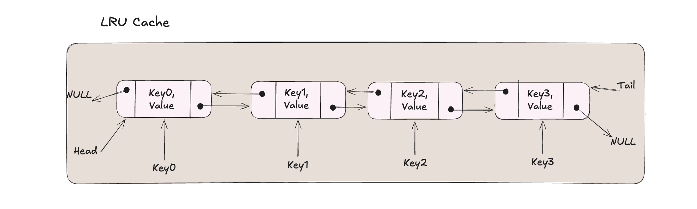
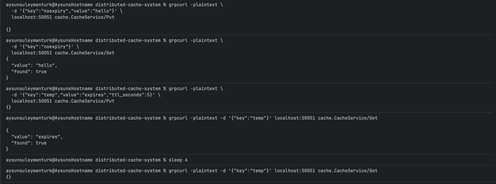
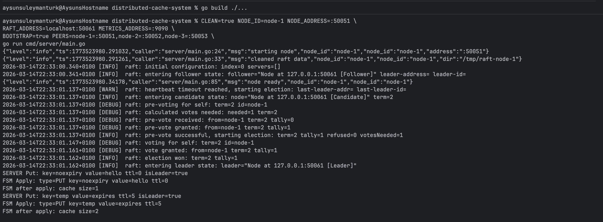

# distributed-cache-system
A distributed in-memory cache built from scratch in
Go — similar to how Redis Cluster works internally. 
Implements consistent hashing for data partitioning, 
Raft consensus for fault-tolerant replication,
and gRPC for inter-node communication.

A production-grade distributed cache where:

- Data is split across multiple nodes using consistent hashing
- Every write is replicated to all nodes via the Raft consensus algorithm
- Any node can handle any request — it routes to the correct node automatically
- The cluster survives node failures and elects a new leader within ~3 seconds

## Project structure:
```
distributed-cache-system/
├── cmd/
│   └── server/
│       └── main.go             ← entry point, wires everything together
├── configs/
│   └── config.go               ← loads config from environment variables
├── internal/
│   ├── cache/
│   │   ├── lru.go              ← thread-safe generic LRU cache
│   │   └── lru_test.go         ← unit tests
│   ├── client/
│   │   └── client.go           ← gRPC connection pool to peer nodes
│   ├── fsm/
│   │   └── fsm.go              ← Raft FSM — bridges Raft log and LRU cache
│   ├── raft/
│   │   └── node.go             ← Raft node setup and cluster management
│   ├── ring/
│   │   ├── ring.go             ← consistent hash ring with virtual nodes
│   │   └── ring_test.go        ← unit tests
│   └── server/
│       └── server.go           ← gRPC server, request routing, Raft writes
├── proto/
│   ├── cache.proto             ← gRPC service definition
│   ├── cache.pb.go             ← generated — do not edit
│   └── cache_grpc.pb.go        ← generated — do not edit
├── k8s/                        ← Kubernetes manifests (Sprint 5)
├── docker-compose.yml          ← local 3-node cluster
├── Dockerfile                  ← multi-stage container build
└── go.mod
```
## LRU Cache Design

The cache provides O(1) access since it uses a 
map from key K to a DLL node (Entry)
which is a (Key,Value) pair and pointers to previous and next element.
The map allows fast lookup to the nodes, while DLL maintains the order for least and
most recently used elements.
The cache keeps a pointer to the head, which represents the most 
recently used element, and a pointer to the tail, 
which represents the least recently used element.

## How the request flows
```
client sends Put("user:alice", "alice") to any node
        ↓
receiving node hashes the key via consistent hash ring
        ↓
ring says "node-2 owns this key"
        ↓
if this node IS node-2 → apply command via Raft
if this node IS NOT node-2 → forward to node-2 via gRPC pool
        ↓
Raft leader replicates the log entry to all followers
        ↓
once majority confirms → FSM.Apply runs on all nodes
        ↓
lru.Put("user:alice", "alice") called on every node
        ↓
data is consistent across the entire cluster
```


### Running Locally
##### Terminal 1 - node 1 (bootstrap leader):
```
CLEAN=true NODE_ID=node-1 NODE_ADDRESS=:50051 \
RAFT_ADDRESS=localhost:50061 METRICS_ADDRESS=:9090 \
BOOTSTRAP=true PEERS=node-1=:50051,node-2=:50052,node-3=:50053 \
go run cmd/server/main.go
```

##### Terminal 2 - node 2:
```
CLEAN=true NODE_ID=node-2 NODE_ADDRESS=:50052 \
RAFT_ADDRESS=localhost:50062 METRICS_ADDRESS=:9091 \
PEERS=node-1=:50051,node-2=:50052,node-3=:50053 \
go run cmd/server/main.go
```

##### Terminal 3 - node 3:
```
CLEAN=true NODE_ID=node-3 NODE_ADDRESS=:50053 \
RAFT_ADDRESS=localhost:50063 METRICS_ADDRESS=:9092 \
PEERS=node-1=:50051,node-2=:50052,node-3=:50053 \
go run cmd/server/main.go
```

##### Terminal 4 - Join nodes:
```
grpcurl -plaintext \
  -d '{"node_id":"node-2","address":"localhost:50062"}' \
  localhost:50051 cache.CacheService/Join

grpcurl -plaintext \
  -d '{"node_id":"node-3","address":"localhost:50063"}' \
  localhost:50051 cache.CacheService/Join
```


### API Reference
###### Put
```
grpcurl -plaintext -d '{"key":"name","value":"alice"}' localhost:50051 cache.CacheService/Put
```

###### Put with TTL
```
grpcurl -plaintext -d '{"key":"session","value":"xyz","ttl_seconds":300}' localhost:50051 cache.CacheService/Put
```

###### Get
```
grpcurl -plaintext -d '{"key":"name"}' localhost:50051 cache.CacheService/Get
```

###### Remove
```
grpcurl -plaintext -d '{"key":"name"}' localhost:50051 cache.CacheService/Remove
```

###### Size
```
grpcurl -plaintext -d '{}' localhost:50051 cache.CacheService/Size
```

###### Clear

```
grpcurl -plaintext -d '{}' localhost:50051 cache.CacheService/Clear
```

##### TTL Expiry Test
Keys are automatically deleted after their TTL expires. Put a key with 5-second TTL, read it immediately (found), wait 6 seconds, read again (gone).


##### Server Logs
Node startup, leader election, and FSM apply events logged as structured JSON via Uber Zap.


##### Metrics
```
curl localhost:9090/metrics | grep cache
```